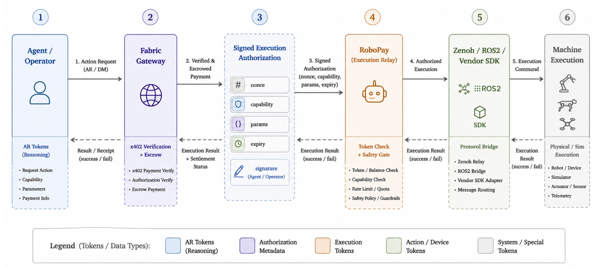

# RoboPay

Fabric RoboPay connects robots, simulators, cameras, drones, and other physical devices to the Fabric network. It provides a secure paid-action runtime that receives remote action requests, verifies payment through the robot-side tunnel flow, and routes approved actions to connected machines.

## Overview

Fabric introduces a payment layer for machines. RoboPay is the execution component of this stack, exposing machine capabilities as paid endpoints.

A core design principle is that **payment, routing, and execution are separated**. The Fabric backend/proxy receives a paid action request and routes it to the correct robot tunnel by `robotId`. It does not directly verify x402 payment in the production tunnel flow.

The robot-side `tunnel` receives the action request, runs x402 middleware, verifies or rejects the payment, and only publishes a verified action to the robot execution layer after successful verification. The robot controller still owns final safety — **a verified payment is not permission to move unconditionally**.



## Repository layout

```
.
├── tunnel/          # Go tunnel + x402 paid-action runtime
│   └── config.json  # robot_id, payee address, price, network
├── bridge/          # ROS2 bridge: Zenoh action events → robot /cmd_vel
│   ├── common/zenoh_bridge/                 # shared Zenoh + action parsing
│   └── unitree/{g1,go2,tron1}/isaac_sim_bridge/   # per-robot ROS2 packages
└── Makefile         # builds/runs the tunnel and the bridge
```

The simulator itself is **not** vendored here. Isaac Sim scenes and policies live in the [OM1-sim](https://github.com/OpenMind/OM1-sim) repo.

## Tier 1 simulator profile: LimX TRON 2

This branch includes the LimX TRON 2 `WF_TRON2A` **simulator-only** Tier 1
profile: payment-gated obstacle navigation with actuator-level MuJoCo evidence,
an explicitly task-level Webots cross-check, real Zenoh correlation, and a Base
Sepolia x402 evidence workflow. Start with the profile runbook for pinned model
provenance, setup, test commands, safety boundaries and troubleshooting:

-> [LimX TRON 2 profile runbook](registry/vendors/limx/tron2/limx.tron2.wheeled-mujoco-webots-obstacle-nav.v1/README.md)


## 1. Start the simulator (Isaac Sim / OM1-sim)

The simulator lives in a separate repo, [OpenMind/OM1-sim](https://github.com/OpenMind/OM1-sim). It requires Ubuntu 22.04, ROS2 Humble, an NVIDIA GPU, and Isaac Sim 5.1.0+.

```bash
git clone https://github.com/OpenMind/OM1-sim.git
cd OM1-sim

export ISAACSIM_ROOT=/path/to/isaacsim
export RMW_IMPLEMENTATION=rmw_cyclonedds_cpp
source /opt/ros/humble/setup.bash
cd isaac_sim && "$ISAACSIM_ROOT/python.sh" run.py --robot_type g1
```

The sim subscribes to ROS2 `/cmd_vel` and drives the robot policy from it.

## 2. Start the bridge

The bridge is a ROS2 workspace under `bridge/`. It needs ROS2 Humble and a Python environment with `eclipse-zenoh`, managed with [uv](https://docs.astral.sh/uv/).

```bash
uv venv --python 3.10
source .venv/bin/activate
uv pip install eclipse-zenoh

make bridge-build
make bridge-run                 # defaults to G1; ROBOT=go2 or ROBOT=tron1 to switch
```

Package names are `isaac_sim_bridge_g1`, `isaac_sim_bridge_go2`, and `isaac_sim_bridge_tron1` (G1 is validated; Go2 and Tron1 are placeholders). The adapter subscribes to the Zenoh topic `robot/tunnel/action` and republishes mapped velocities on ROS2 `/cmd_vel`.

## 3. Start the tunnel

The tunnel (`tunnel/`) keeps an outbound WebSocket to the Fabric proxy, verifies x402 micropayments, and publishes accepted actions to the same Zenoh topic the bridge listens on.

`tunnel/config.json` is deliberately an inert checked-in example. Set the
stable robot identity and payee in an untracked `tunnel/.env` (or a deployment
secret manager) before starting the Tunnel:

```json
{
  "robot_id": "my-robot",
  "evm_payee_address": "0xYourAddress",
  "price": "0.001",
  "network": "eip155:84532"
}
```

Build and run from the repo root (the `Makefile` operates inside `tunnel/`):

```bash
make build
make run
make test
```

Common environment overrides:

| Variable          | Default                                          | Description                       |
|-------------------|--------------------------------------------------|-----------------------------------|
| `PROXY_WS_URL`    | `wss://api.fabric.foundation/api/core/ws/robot`  | WebSocket URL of the tunnel proxy |
| `FACILITATOR_URL` | `https://x402.org/facilitator`                   | x402 payment facilitator endpoint |
| `GIN_MODE`        | `release`                                        | `debug` for verbose HTTP logs     |

### Fail-closed paid action contract

Every deployment supplies a robot-scoped skill catalog and an explicit
allowlist. The Tunnel refuses all actions until both are configured:

```bash
ROBOT_ID=limx-tron2-wf-sim-01
ROBO_PAYEE_ADDRESS=0xYourAddress
SKILL_CATALOG_PATH=../registry/vendors/limx/tron2/limx.tron2.wheeled-mujoco-webots-obstacle-nav.v1/skill-catalog.json
ALLOWED_ACTIONS=navigate_obstacle_course,stop
```

`POST /action` verifies x402 before publishing anything to Zenoh and returns
`202 Accepted` with an `action_id` and `status_url`. Settlement is deferred
until a terminal result matches the exact action, robot, skill, parameter hash
and idempotency key. Invalid payment, failure, timeout, mismatch and replay do
not actuate or settle.

The current shared Fabric Tunnel/proxy identifies the robot by its configured
ID but does not yet provide a signed robot-to-payee handshake. That binding is
an upstream protocol dependency; this profile does not claim otherwise.

## 4. Register the robot on BitAgent (Unibase AIP) — optional

With `AIP_ENABLED=true`, the tunnel additionally registers the robot as an
A2A-compatible discovery agent on the BitAgent network (Unibase AIP). Direct
execution remains restricted to the x402-verified Tunnel endpoint. The
integration is built on the
[Unibase AIP Go SDK](https://github.com/unibaseio/aip-go-sdk) — see
`tunnel/internal/aipagent/agent.go`, which wraps the robot in a single
`wrappers.ExposeAsA2A(...)` call.

How AIP traffic flows:

```
AIP client → AIP gateway (/robots/<robot_id>/…) → Fabric proxy (ws) → tunnel
           → AIP handler → Zenoh topic robot/tunnel/action → bridge → /cmd_vel
```

The tunnel serves the A2A contract endpoints (`/.well-known/agent-card.json`,
`/invoke`, …) on any route not owned by the paid-action API, and the gateway
proxies them to the robot verbatim.

### Configuration

Copy the example env file and fill in your credentials (the tunnel loads
`.env` from its working directory on start):

```bash
cp tunnel/.env.example tunnel/.env
```

| Variable             | Required | Description                                              |
|----------------------|----------|----------------------------------------------------------|
| `AIP_ENABLED`        | yes      | Set `true` to enable BitAgent/AIP registration           |
| `CHAIN`              | no       | Chain preset: `bsc-testnet`, `bsc-mainnet`, `base-sepolia` or `base-mainnet` — sets both the x402 payment network and the AIP registration chain |
| `UNIBASE_PROXY_AUTH` | no*      | Bearer token — your account is resolved from it (falls back to `PRIVY_TOKEN`) |
| `AIP_USER_ID`        | no*      | Token-less fallback: wallet address to register under    |
| `AIP_ENDPOINT`       | no       | AIP platform URL (default `https://api.aip.unibase.com`) |
| `GATEWAY_URL`        | no       | AIP gateway URL (default `https://gateway.aip.unibase.com`) |
| `AIP_PUBLIC_BASE_URL`| no       | Public gateway base (default `https://api.fabric.foundation/api/core`) |
| `AIP_AGENT_NAME`     | no       | Display name (default `Robot <robot_id>`)                |
| `AIP_LOCAL_PORT`     | no       | Local port the SDK binds (default `8000`)                |

\* When neither is set, the tunnel walks you through a one-time browser
authorization on first run — open the printed URL, approve with your wallet,
and paste the token back. It is cached in
`~/.config/unibase-aip-sdk/config.json` for subsequent runs:

```
=== Unibase Authorization ===
[1/3] Fetching authorization URL ...
[2/3] Open this URL in your browser and approve:

  https://auth.pay.unibase.com?code=<one-time-code>

[3/3] Paste your Authorization token below and press Enter:
```

Then start the tunnel as usual (`make run`). On success the log shows:

```
registering robot as AIP agent  robot_id=<id>  endpoint_url=…/robots/<id>
ws connected to proxy           robot_id=<id>
```

Direct actions received through AIP are intentionally rejected and never
published to Zenoh because AIP job input does not currently carry the exact
Tunnel-verified payment and correlation contract. Use the paid Tunnel action
endpoint for execution; AIP remains discovery-only.
