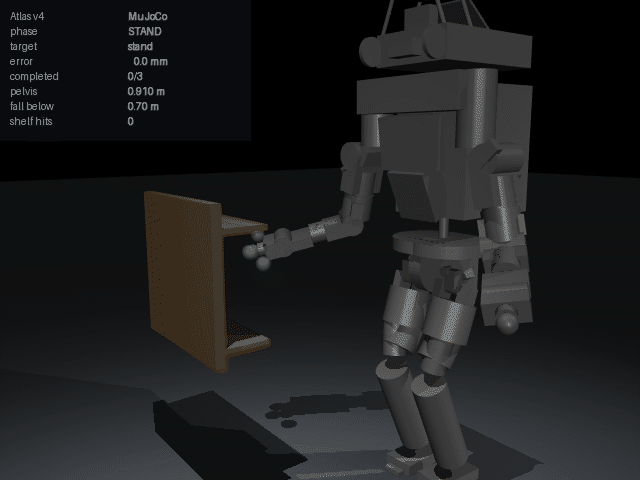

# Boston Dynamics Atlas — RoboPay simulator bridge

Paid, policy-driven **shelf inspection** on a free-standing Boston Dynamics
Atlas v4, validated across MuJoCo, PyBullet and Webots R2025a.



## What it does

A payment-gated `inspect_shelf` skill. Once x402 verification passes, a state
machine walks Atlas through three shelf points and only then does the action
settle:

```
STAND ──▶ REACH(t) ──▶ VERIFY(t) ──▶ … ──▶ RETURN ──▶ DONE
              ▲            │
              └────────────┘   hold broken → re-converge
```

Each control tick re-reads the measured end-effector pose and the measured
joint configuration and solves a damped least-squares resolved-rate step. There
is no recorded trajectory anywhere in the bridge.

## Measured results

| Metric | MuJoCo | PyBullet | Webots |
| --- | --- | --- | --- |
| Targets reached and held | 3 / 3 | 3 / 3 | 3 / 3 |
| Mean end-effector error | 9.5 mm | 12.2 mm | 9.0 mm |
| Max end-effector error | 13.5 mm | 19.8 mm | 12.3 mm |
| Min pelvis height (fall threshold 0.70 m) | 0.908 m | 0.940 m | 0.898 m |
| Shelf collisions | 0 | 0 | 0 |
| Episode duration | 4.61 s | 4.98 s | 7.70 s |

Raw output: [`docs/evidence/`](../../../docs/evidence/). Running any of the
commands below prints its result; none of them rewrites the committed evidence
unless you pass `--json-output`, so reproducing leaves the tree clean. MuJoCo runs are
bit-identical across repeats — see `test_run_is_repeatable`.

## The robot

Atlas v4 is **fetched, never vendored**. `models/model.lock.json` pins
[openai/roboschool](https://github.com/openai/roboschool) at
`d32bcb2` (MIT). Collision geometry upstream is analytic, so no mesh assets are
needed and none are committed. See [`NOTICE.md`](NOTICE.md).

One URDF drives every engine:

```
atlas_v4_with_multisense.urdf
        │
        ├── MuJoCo    (URDF → MJCF at load time)
        ├── PyBullet  (loaded directly)
        └── Webots    (URDF → PROTO at setup time)
```

The Jacobian **and** the gravity feedforward are derived from that same URDF by
[`kinematics.py`](kinematics.py) rather than from each engine, so the controller
is literally identical everywhere. MuJoCo has `qfrc_bias` and PyBullet has
inverse dynamics, but Webots has neither — computing both terms from the model
keeps the three backends honestly the same controller.
`tests/test_kinematics.py` checks the Jacobian and the gravity model against
MuJoCo's independently computed ones.

## Setup

```bash
pip install -r bridge/boston_dynamics/atlas_bridge/requirements.txt
python -m bridge.boston_dynamics.atlas_bridge.download_atlas_model
```

## Run

```bash
python -m bridge.boston_dynamics.atlas_bridge.runner
```

```bash
python -m bridge.boston_dynamics.atlas_bridge.pybullet_runner
```

```bash
python -m bridge.boston_dynamics.atlas_bridge.sim2sim
```

```bash
python -m bridge.boston_dynamics.atlas_bridge.demo_e2e
```

The same flow over the real Zenoh transport, gate to simulator to correlated
result (peer mode, no router needed):

```bash
python -m bridge.boston_dynamics.atlas_bridge.demo_tunnel
```

The same path through the repository's own Go tunnel, with its real x402
middleware making the payment decision — see
[`TUNNEL_BUILD.md`](TUNNEL_BUILD.md) to build it once:

```bash
python -m bridge.boston_dynamics.atlas_bridge.demo_go_tunnel --tunnel /path/to/tunnel
```

```bash
python -m bridge.boston_dynamics.atlas_bridge.reach_envelope
```

```bash
python -m bridge.boston_dynamics.atlas_bridge.settlement_evidence
```

```bash
python -m bridge.boston_dynamics.atlas_bridge.visual_evidence
```

Webots (requires a local Webots R2025a install, or `WEBOTS_EXE` set — the world
and the PROTO are generated from the same pinned URDF on the way in):

```bash
python -m bridge.boston_dynamics.atlas_bridge.webots_env
```

Tests:

```bash
python -m pytest bridge/boston_dynamics/atlas_bridge/tests -q
```

## Payment safety

`x402.py` verifies the receipt (amount, asset, network, expiry, replay) and
`relay.py` gates execution behind it. `payment.py` holds the settlement ledger.
The invariant the tests pin down:

| Case | HTTP | Executed | Settled |
| --- | --- | --- | --- |
| No payment | 402 | no | no |
| Wrong amount / asset / network | 400 | no | no |
| Valid payment, task succeeds | 200 | yes | **yes** |
| Valid payment, task fails or is stopped | 200 | yes | no |
| Replayed receipt | 409 | no | no |
| Forged authorization (facilitator) | 400 | no | no |
| Repeat of an idempotency key | — | no | no |

A settlement of this skill on Base Sepolia:
[`0x5b04259e…26b6e`](https://sepolia.basescan.org/tx/0x5b04259e0d9cfe319a6ffec3d7f6b9118b70e09ae4a832625bed5ecd48326b6e)
— 1.0 USDC, block 45670338, status success. `settlement_evidence.py` re-reads it
from a public RPC and fails if it does not verify. Testnet only, and no key
material lives in this repository.

## Operating the bridge

### Requirements

| | |
| --- | --- |
| Python | 3.12+ |
| MuJoCo | 3.11+ (installed by `requirements.txt`) |
| PyBullet | installed by `requirements.txt` |
| Webots | R2025a, installed separately — only needed for the Webots run |
| Zenoh | `eclipse-zenoh` plus a reachable router, only needed for the tunnel |

### Configuration

Every setting has a working default; none is required for the simulator runs.

| Variable | Default | Purpose |
| --- | --- | --- |
| `ROBOT_ID` | `atlas-sim-01` | Identity this bridge answers for; actions for other robots are ignored |
| `ZENOH_ENDPOINT` | *(peer mode)* | Router to connect to, e.g. `tcp/127.0.0.1:7447` |
| `ZENOH_CONFIG` | — | Path to a Zenoh config file; takes precedence over the endpoint |
| `ZENOH_ACTION_TOPIC` | `robot/tunnel/action` | Where payment-validated actions arrive |
| `ZENOH_RESULT_TOPIC` | `robot/tunnel/result` | Where correlated results are published |
| `ZENOH_METRICS_TOPIC` | `robot/boston_dynamics_atlas/metrics` | Simulator metrics stream |
| `ZENOH_READY_TOPIC` | `robot/boston_dynamics_atlas/ready` | Announced once on startup |
| `ATLAS_MJCF_DIR` | *(fetched cache)* | Override the Atlas description directory |
| `WEBOTS_EXE` | *(auto-discovered)* | Webots executable, if not on `PATH` |
| `WEB3_PROVIDER_URL` | — | RPC endpoint, only for executing a settlement |
| `SETTLEMENT_PRIVATE_KEY` | — | **Never commit this.** Only for executing a settlement |

**Security.** `SETTLEMENT_PRIVATE_KEY` is read from the environment and is never
written to disk, logged, or included in any evidence artefact. Use a dedicated
testnet wallet and treat it as disposable. This repository contains no key
material, and CI fails the build if any appears in the diff.

### Start the tunnel bridge

```bash
zenohd
```

```bash
python -m bridge.boston_dynamics.atlas_bridge.bridge
```

On startup it announces itself on the ready topic with its profile id, robot id
and registered skills, then subscribes to the action topic.

### Send an action

The envelopes the profile ships are the ones the bridge accepts:

```bash
zenoh put robot/tunnel/action --value "$(cat registry/vendors/boston-dynamics/atlas/boston-dynamics.atlas.mujoco-pybullet-webots-shelf-inspection.v1/examples/action-envelope.inspect_shelf.json)"
```

**Expected success** on `robot/tunnel/result` — note that every correlation
field from the request is echoed back:

```json
{
  "action_id": "act-atlas-inspect-0001",
  "robot_id": "atlas-sim-01",
  "skill_id": "inspect_shelf",
  "params_hash": "sha256:…",
  "idempotency_key": "idem-atlas-inspect-0001",
  "status": "success",
  "profile_id": "boston-dynamics.atlas.mujoco-pybullet-webots-shelf-inspection.v1",
  "result": { "targets_completed": 3, "shelf_contacts": 0, "fall_detected": false }
}
```

**Expected failures**, all answered on the same topic and never settled:

| Cause | `status` | `result.error_code` |
| --- | --- | --- |
| Skill not registered | `failure` | `UNREGISTERED_ACTION` |
| `action` and `skill_id` disagree | `failure` | `ACTION_SKILL_MISMATCH` |
| Undeclared or out-of-range parameter | `failure` | `INVALID_PARAMS` / `INVALID_DURATION` |
| Another episode already running | `failure` | `ROBOT_BUSY` |
| Simulator raised | `failure` | `SIMULATOR_EXECUTION_ERROR` |
| Malformed envelope | *(no reply)* | rejected before the simulator is touched |
| Action for another robot | *(no reply)* | ignored |

**Safe stop** — interrupts a running episode; the interrupted inspection returns
`completion_reason: safe_stopped` with `success: false`, so it cannot settle:

```bash
zenoh put robot/tunnel/action --value "$(cat registry/vendors/boston-dynamics/atlas/boston-dynamics.atlas.mujoco-pybullet-webots-shelf-inspection.v1/examples/action-envelope.stop.json)"
```

### Troubleshooting

| Symptom | Cause | Fix |
| --- | --- | --- |
| `Install eclipse-zenoh to run the Atlas bridge` | Transport extra missing | `pip install eclipse-zenoh` |
| Bridge starts but nothing arrives | Router unreachable, or peer mode | Set `ZENOH_ENDPOINT` to the router |
| No reply at all to an action | `robot_id` mismatch or malformed envelope | Check `ROBOT_ID`; both cases are logged |
| `Atlas download did not produce …` | Fetch blocked | Re-run `download_atlas_model`, check network |
| `Webots was not found` | Not installed or not on `PATH` | Install R2025a or set `WEBOTS_EXE` |
| Settlement command exits non-zero | RPC unreachable or tx not found | Retry; the check is read-only and safe |

## Layout

| Path | Role |
| --- | --- |
| `task.py` | Shelf geometry, targets, stance, thresholds — one source for all engines |
| `control_core.py` | State machine + damped least-squares resolved-rate IK |
| `model.py` | URDF → MJCF, actuators generated from URDF effort limits |
| `actuators.py` | Actuator addressing read from the compiled model, with drift checks |
| `episode.py` | Engine-agnostic episode loop and metric reporting |
| `mujoco_env.py`, `pybullet_env.py`, `webots_env.py` | Per-engine backends |
| `x402.py`, `relay.py`, `payment.py`, `settlement.py` | Payment gate and ledger |
| `facilitator.py` | Live x402 facilitator verification, failing closed |
| `idempotency.py` | Durable one-actuation-per-key store |
| `bridge.py` | Tunnel integration: action handler plus its Zenoh wiring |
| `demo_tunnel.py` | Paid action over the real Zenoh transport, end to end |
| `demo_go_tunnel.py` | The same path through the repository's own Go tunnel |
| `kinematics.py` | URDF-derived forward kinematics, Jacobian and gravity model |
| `reach_envelope.py` | Measures where Atlas can reach without losing balance |
| `settlement_evidence.py` | Re-reads the on-chain settlement from Base Sepolia |
| `visual_evidence.py` | Renders the annotated episode GIF |
