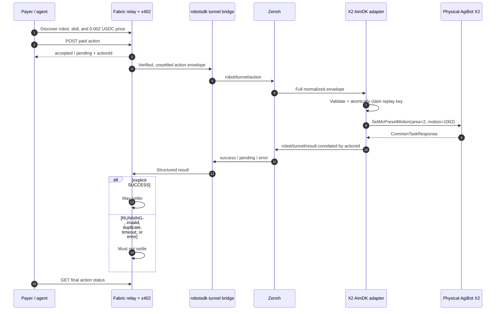

# AgiBot X2 AimDK RoboPay profile

This profile exposes one physically validated vendor action, `x2_right_wave`,
as a paid RoboPay skill under the **Fabric Foundation × AgiBot** brand. It is a
Tier 2 submission: the adapter invokes AgiBot's built-in AimDK preset motion
`SetMcPresetMotion(area=2, motion=1002)` on a physical X2.

> Validation status: **historical real x402 payment validation and settlement
> completed.** The redacted terminal record shows HTTP 200,
> `settlement.success=true`, transaction `0x35fa38...605a0a`, and "action paid
> for and payload delivered" at `2026-07-13T12:55:29+08:00`. The bridge record
> places AimDK `task_id=8` at epoch `1783918529.509...`, the same wall-clock
> second, and the redacted video shows the physical right-hand wave. This
> historical settlement was not gated by a terminal `robot/tunnel/result`, and
> AimDK reported `RUNNING`; the stricter success-after-result and
> failure-without-settlement contract still requires one new physical rerun.
> See [validation-report.md](validation-report.md).

Only the right-hand wave is registered. Unvalidated left-arm, handshake,
locomotion, and emergency-stop actions are intentionally excluded.

## Package contents

| File | Purpose |
| --- | --- |
| `robot.profile.yaml` | Physical X2 runtime, identity, scope, and safety metadata |
| `skills.yaml` | Discoverable, priced right-hand-wave skill contract |
| `functions.yaml` | Agent-facing discovery, action, and status functions |
| `payment-policy.yaml` | Base Sepolia USDC policy and result-gated settlement rule |
| `execution-mapping.yaml` | Zenoh-to-AimDK mapping and completion semantics |
| `examples/action-envelope.right-wave.json` | Non-production example envelope |
| `bridge/agibot_x2_robopay_bridge.py` | Fail-closed Zenoh/AimDK robot adapter |
| `tests/skill-contract.test.yaml` | Human-readable contract cases |
| `tests/test_bridge.py` | Executable parser, replay, result, and privacy tests |

## End-to-end architecture

The shared Fabric relay/tunnel owns x402 verification, robot authentication via
`robotsdk`, immediate HTTP `accepted`/`pending`, status storage, and settlement.
This vendor package supplies the profile and the robot-local AimDK adapter.



The current repository's shared tunnel must be wired to the result-gated path
shown above before the new physical acceptance run. This profile never settles
or charges a payment itself.

## Traceability model

Every accepted action is traceable without logging wallet secrets:

| Stage | Correlation data | Persisted or visible evidence |
| --- | --- | --- |
| Payment authorization | `actionId`, `authorizationId`, network, amount | Fabric relay authorization record |
| Tunnel delivery | `actionId`, `robotId`, `idempotencyKey`, `paramsHash` | Relay/robotsdk logs |
| Local admission | Same fields plus `authorizationId` | JSON audit line + SQLite replay record |
| AimDK dispatch | `actionId`, vendor `taskId`, area `2`, motion `1002` | Adapter audit line |
| Final result | Same `actionId`, status, vendor state, `settlementEligible` | `robot/tunnel/result` + status endpoint |
| Physical outcome | action marker paired with terminal log | Redacted field video |

The adapter never logs payer, payee, full transaction hashes, payment
signatures, private keys, hostnames, usernames, or IP addresses.

## Historical real-payment and physical evidence

The repository includes three privacy-reviewed derivatives:

- [historical payment terminal](evidence/terminal/agibot-x2-historical-payment-terminal-redacted.png),
  showing HTTP 200, `settlement.success=true`, the masked transaction reference,
  Base Sepolia, and the payload-delivered confirmation;
- [historical bridge task 8 terminal](evidence/terminal/agibot-x2-historical-bridge-task8-redacted.png),
  showing AimDK admission for `task_id=8` at epoch `1783918529.509...`; and
- [historical physical wave video](evidence/agibot-x2-historical-physical-evidence-redacted.mp4),
  showing the physical X2 right-hand wave associated with task 8.

The payment acceptance time, `2026-07-13T12:55:29+08:00`, and the bridge task
time, `2026-07-13T12:55:29.509+08:00`, are within the same wall-clock second.
Together with the private source records listed by hash in the
[evidence manifest](evidence/evidence-manifest.yaml), these artifacts document
that the historical real x402 payment, settlement, payload delivery, bridge
admission, and physical motion occurred. They do **not** claim that the
historical settlement waited for a terminal result: AimDK was still `RUNNING`,
and the newer result-gated success/failure acceptance run remains pending.

## Action envelope

`robot/tunnel/action` carries one direct JSON object. The bridge rejects missing
or extra fields, duplicate JSON keys, incorrect types, an unknown robot or
skill, a tampered hash, reused action/idempotency/payment-authorization IDs, and
invalid or expired payment evidence before calling AimDK.

```json
{
  "actionId": "act_example_x2_wave_001",
  "robotId": "agibot-x2-demo-001",
  "skillId": "x2_right_wave",
  "params": {"interrupt": true},
  "paramsHash": "945b8598389f04a2fef4e52f80313c4d23abbf6271f40ff7a5fb8d8b2e88abf4",
  "idempotencyKey": "example-x2-wave-001",
  "payment": {
    "provider": "x402",
    "authorizationId": "auth_example_x2_wave_001",
    "verified": true,
    "status": "authorized",
    "settled": false,
    "network": "eip155:84532",
    "asset": "0x036CbD53842c5426634e7929541eC2318f3dCF7e",
    "amount": "2000",
    "payTo": "0x0000000000000000000000000000000000000001",
    "issuedAt": "2026-07-22T00:00:00Z",
    "expiresAt": "2026-07-22T00:05:00Z"
  }
}
```

The committed example uses a syntactically valid non-production address and a
dummy authorization identifier. It is not payment evidence. A `txHash` belongs
to the relay's post-success settlement receipt and must not be invented in a
pre-execution authorization. Its timestamps are a fixed five-minute
documentation window and will normally be expired; refresh all correlation IDs
and both timestamps immediately before a dry run. Production authorizations
default to a maximum 300-second TTL and allow at most 30 seconds of future clock
skew. `paramsHash` is SHA-256 of
UTF-8 JSON with keys sorted, compact separators, no NaN values, and unescaped
Unicode. For the example params, the hashed bytes are exactly:

```text
{"interrupt":true}
```

## Result envelope and completion semantics

`robot/tunnel/result` carries `robot-action-result.v1`. Results preserve
`actionId`, `robotId`, `skillId`, `idempotencyKey`, and `paramsHash`.

| AimDK observation | RoboPay status | `settlementEligible` | Meaning |
| --- | --- | --- | --- |
| Explicit `CommonState.SUCCESS` and code `0` | `success` | `true` | Vendor reports terminal completion |
| `CommonState.RUNNING` | `pending` | `false` | Accepted/running; not terminal |
| Code `0` without an explicit state | `pending` | `false` | Request accepted; completion unknown |
| Rejection, unavailable service, or exception | `error` | `false` | No settlement |
| ROS response timeout | `error/ACTION_OUTCOME_UNKNOWN` | `false` | May have actuated; never retry or settle automatically |
| Dry run | `pending` | `false` | Contract/mapping validation only |

The vendor documentation says `SetMcPresetMotion` can return `RUNNING`. The
historical field log returned `RUNNING` with `task_id=8`; this proves admission,
not terminal completion. The physical video proves the visible wave separately.
The new acceptance run must capture an explicit terminal signal or leave the
action pending and unsettled.

Example final success:

```json
{
  "schemaVersion": "robot-action-result.v1",
  "actionId": "act_example_x2_wave_001",
  "robotId": "agibot-x2-demo-001",
  "skillId": "x2_right_wave",
  "idempotencyKey": "example-x2-wave-001",
  "paramsHash": "945b8598389f04a2fef4e52f80313c4d23abbf6271f40ff7a5fb8d8b2e88abf4",
  "status": "success",
  "settlementEligible": true,
  "result": {
    "message": "AgiBot X2 reported the preset motion completed",
    "vendor": {"service": "/aimdk_5Fmsgs/srv/SetMcPresetMotion", "taskId": 8, "state": 0, "code": 0},
    "simulated": false
  },
  "timestamp": "2026-07-22T00:00:00.000Z"
}
```

## Requirements

- Physical AgiBot X2 with a clear safety radius and an operator holding the
  physical remote/e-stop.
- Robot already placed in AimDK Stable Standing Mode.
- Vendor AimDK_X2 1.0.0 environment and ROS 2 Humble sourced.
- `/aimdk_5Fmsgs/srv/SetMcPresetMotion` available.
- Python 3.10+ and the Zenoh Python binding (`python3 -m pip install eclipse-zenoh`).
- A Zenoh router/session and the shared Fabric robotsdk tunnel connected
  outbound from the robot network.

## Configuration

Use environment variables or a secret manager. Values below are placeholders.

```bash
export ROBOPAY_ROBOT_ID="agibot-x2-demo-001"
export ROBOPAY_PAYEE_ADDRESS="0xREPLACE_WITH_BOUND_PAYEE_ADDRESS"
export ROBOPAY_NETWORK="eip155:84532"
export ROBOPAY_ASSET="0x036CbD53842c5426634e7929541eC2318f3dCF7e"
export ROBOPAY_AMOUNT="2000"
export ROBOPAY_MAX_AUTH_TTL_SEC="300"
export ROBOPAY_FUTURE_CLOCK_SKEW_SEC="30"
export ROBOPAY_STATE_DB="/var/lib/robopay/agibot-x2-replay.sqlite3"
export ROBOPAY_ACTION_TOPIC="robot/tunnel/action"
export ROBOPAY_RESULT_TOPIC="robot/tunnel/result"
```

The shared `robotsdk` tunnel, not this local adapter, loads the robot identity
key from `ROBOT_PRIVATE_KEY` and binds it to `ROBOPAY_PAYEE_ADDRESS`. Never put a
real private key in shell history, a committed `.env`, screenshots, logs, or the
example envelope.

The TTL can be configured only from 1 to 3,600 seconds. Future clock skew can
be configured only from 0 to 300 seconds. The defaults above should be retained
unless the deployment has a documented network/clock requirement. Synchronize
the robot host with a trusted time source; increasing these values is not a
substitute for fixing clock drift.

## Run and test

From this profile directory, first run the standard-library tests:

```bash
python3 -m unittest discover -s tests -p 'test_*.py' -v
```

The committed envelope is intentionally a static documentation artifact, so do
not pipe it directly into the bridge. Generate fresh action, idempotency,
authorization, issuance, and expiry values first. The following creates a
five-minute dummy authorization and a fresh temporary replay DB without touching
the robot:

```bash
tmp_dir="$(mktemp -d)"
export TMP_ENVELOPE="$tmp_dir/right-wave.json"

python3 - <<'PY'
import json
import os
from datetime import datetime, timedelta, timezone
from pathlib import Path

source = Path("examples/action-envelope.right-wave.json")
envelope = json.loads(source.read_text(encoding="utf-8"))
now = datetime.now(timezone.utc).replace(microsecond=0)
suffix = now.strftime("%Y%m%dT%H%M%SZ")
envelope["actionId"] = f"act_example_x2_{suffix}"
envelope["idempotencyKey"] = f"example-x2-{suffix}"
envelope["payment"]["authorizationId"] = f"auth_example_x2_{suffix}"
envelope["payment"]["issuedAt"] = now.isoformat().replace("+00:00", "Z")
envelope["payment"]["expiresAt"] = (
    now + timedelta(seconds=300)
).isoformat().replace("+00:00", "Z")
Path(os.environ["TMP_ENVELOPE"]).write_text(
    json.dumps(envelope, indent=2) + "\n", encoding="utf-8"
)
PY

python3 bridge/agibot_x2_robopay_bridge.py \
  --stdin --dry-run \
  --robot-id agibot-x2-demo-001 \
  --payee-address 0x0000000000000000000000000000000000000001 \
  --state-db "$tmp_dir/agibot-x2-replay.sqlite3" \
  < "$TMP_ENVELOPE"
```

Expected: a `pending` result with `settlementEligible=false` and
`result.simulated=true`.

For a physical run, source ROS/AimDK, start `zenohd`, then start the adapter:

```bash
source /opt/ros/humble/setup.bash
source /path/to/aimdk/install/setup.bash

python3 bridge/agibot_x2_robopay_bridge.py \
  --zenoh-connect tcp/127.0.0.1:7447
```

The shared authenticated tunnel publishes verified envelopes to
`robot/tunnel/action` and consumes `robot/tunnel/result`. Do not manually
publish the committed dummy envelope during a paid acceptance run.

## Intentional failure checks

The final field recording must demonstrate all of the following:

1. An unpaid action returns HTTP 402 and no Zenoh action is published.
2. A paid action returns immediately as accepted/pending and preserves the full
   correlation envelope.
3. A tampered `paramsHash` or expired payment is rejected before Zenoh and does
   not actuate.
4. Replaying the same action, idempotency key, or payment authorization after an
   adapter restart produces `DUPLICATE`, causes no second motion, and does not
   settle.
5. With the AimDK service unavailable, the result is `ROBOT_UNAVAILABLE` or
   `ACTION_FAILED`, and relay logs prove no settlement.
6. A successful run publishes a terminal result correlated by `actionId` before
   settlement.

Use [field-validation-runbook.md](field-validation-runbook.md) for the capture
order and evidence checklist.

## Safe stop and troubleshooting

- The paid API intentionally exposes no software emergency-stop skill. The
  physical operator must retain the vendor remote/e-stop and can terminate this
  adapter with `Ctrl+C`.
- If the service is unavailable, confirm Stable Standing Mode, source the exact
  AimDK workspace, and run `ros2 service list`.
- If Zenoh has no traffic, verify both topic names and the configured endpoint;
  do not bypass payment verification by manually forwarding a production action.
- If SQLite cannot open, create a bridge-owned state directory with restrictive
  permissions. Do not fall back to in-memory replay protection in production.
- After `ACTION_OUTCOME_UNKNOWN`, inspect the physical robot and vendor logs.
  Never resend the same action automatically.

## Privacy and evidence handling

Public PR material must use **Fabric Foundation × AgiBot** branding and redact
or mask payer/payee addresses, full transaction hashes, payment signatures,
hostnames, usernames, private/internal IP addresses, serial numbers, and people
visible in the background. Full receipts may be retained privately for reviewer
verification. The public terminal PNGs are deterministic crops with opaque
masks; only truncated wallet/transaction references remain in their overlays.
Their raw `proof-payment.png` and `proof-bridge.png` sources are identified by
SHA-256 in the manifest but are not uploaded. Raw editor projects, logs,
`*.pyc`, caches, and unredacted media are not part of this profile.

## Vendor references

- [AimDK_X2 preset motion control](https://x2-aimdk.agibot.com/en/latest/Interface/control_mod/preset_motion.html)
- [AimDK_X2 Python preset-motion example](https://x2-aimdk.agibot.com/en/latest/example/Python.html)
