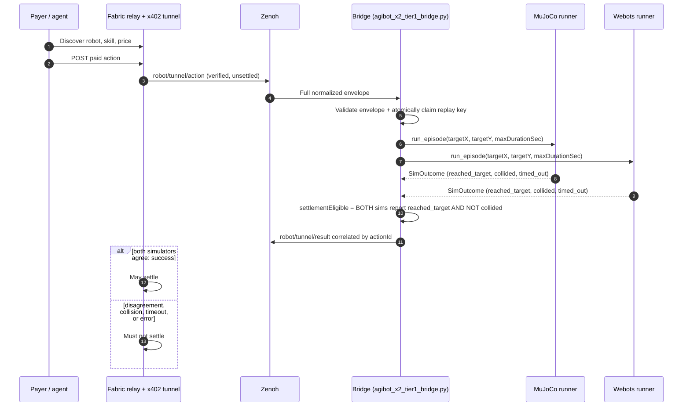

# AgiBot X2 Tier 1 — obstacle-avoidance navigation (simulator-only)

This profile implements the RoboPay Tier 1 bounty for AgiBot X2: a paid
`x2_obstacle_avoid_nav` skill that drives the robot from its start pose to
a target pose while avoiding obstacles, validated independently in **two**
simulators (MuJoCo + Webots) per the Tier 1 Sim-to-Sim requirement.

## Package contents

| File | Purpose |
| --- | --- |
| `robot.profile.yaml` | Robot identity, runtime, and simulator metadata |
| `skills.yaml` | Discoverable, priced `x2_obstacle_avoid_nav` skill contract |
| `payment-policy.yaml` | x402 policy and result-gated (dual-simulator) settlement rule |
| `execution-mapping.yaml` | Zenoh transport, validation rules, and dual-simulator mapping |
| `functions.yaml` | Agent-facing discovery/action/status HTTP functions |
| `examples/action-envelope.obstacle-avoid-nav.json` | Non-production example envelope |
| `bridge/agibot_x2_tier1_bridge.py` | Fail-closed Zenoh bridge: parse, replay-claim, dual-sim execute, result-gate |
| `bridge/policy/obstacle_avoid_policy.py` | Shared reactive potential-field policy (identical control logic in both sims) |
| `bridge/simulators/mujoco_runner.py` | MuJoCo episode runner |
| `bridge/simulators/webots_runner.py` | Webots episode runner (spawns headless Webots per episode) |
| `bridge/simulators/assets/mujoco/x2_primitives.xml` | AgiBot X2 MJCF (see "Mesh assets" below) |
| `bridge/simulators/assets/webots/worlds/x2_obstacle_course.wbt` | Webots world with matching obstacle layout |
| `tests/test_bridge.py` | 23 automated tests: contract validation, replay, Sim-to-Sim disagreement |

## Why collision-primitive geometry, not vendor mesh

The vendor mesh assets are **not fetchable at submission time** from either
upstream source:

- `ioai-tech/robot_description`: every mesh LFS object returns `404 Object
  does not exist on the server` (reproducible; not a local cache issue).
- `AgiBotTech/genie_sim`: LFS pull fails with `This repository exceeded its
  LFS budget`.

Both are server-side conditions affecting any reviewer who tries to
reproduce this submission, not a local misconfiguration. Rather than depend
on unavailable third-party binaries, `x2_primitives.xml` reconstructs the
AgiBot X2 kinematic chain — identical link names, joint names, and joint
offsets extracted directly from `robot_description/mjcf/agibot/x2.xml` —
using primitive capsule/box collision geometry instead of `<geom
type="mesh">`. The model loads, steps, and simulates correctly (verified:
33 bodies, 32 joints, 33 geoms).

**Locomotion abstraction**: the pelvis carries a planar floating base
(slide X, slide Y, hinge yaw) driven by the navigation policy; the full
leg/arm kinematic chain remains physically present and collidable at a
fixed standing pose, contributing real collision volume to obstacle
avoidance. Full bipedal gait synthesis is out of scope for a Tier 1
navigation task — the wiki's own Tier 1 examples list "obstacle navigation"
and "task-conditioned locomotion" as separate categories from full gait
control.

## Architecture



The shared Fabric relay/tunnel (outside this package) owns x402
verification and settlement; this profile never settles a payment itself.

## Shared policy, not duplicated control logic

`bridge/policy/obstacle_avoid_policy.py` is a pure, simulator-agnostic
potential-field policy (attraction to target, repulsion from obstacles).
Both `mujoco_runner.py` and `webots_runner.py` import and drive the
**same** `ObstacleAvoidPolicy` instance logic from an `Observation` dict —
so a Sim-to-Sim disagreement reflects a genuine physics/integration
discrepancy between MuJoCo and Webots, not an artifact of two independently
written controllers.

## Safety property: the policy never collides by design

The potential field's repulsion term grows without bound as the robot
approaches an obstacle, so the policy refuses to enter the obstacle's
influence radius rather than colliding and stopping. Verified manually: an
episode with an unreachable target (placed inside an obstacle) results in
`collided=false` in both simulators, and the episode instead ends in
`timed_out=true` after `maxDurationSec`. Both outcomes correctly produce
`settlementEligible=false`.

## Action envelope

```json
{
  "actionId": "act_example_x2_nav_001",
  "robotId": "agibot-x2-tier1-demo-001",
  "skillId": "x2_obstacle_avoid_nav",
  "params": {"targetX": 3.0, "targetY": 0.0, "maxDurationSec": 30.0},
  "paramsHash": "<sha256 of canonical params JSON>",
  "idempotencyKey": "example-x2-nav-001",
  "payment": {
    "provider": "x402",
    "authorizationId": "auth_example_x2_nav_001",
    "verified": true,
    "status": "authorized",
    "settled": false,
    "network": "eip155:84532",
    "asset": "0x036CbD53842c5426634e7929541eC2318f3dCF7e",
    "amount": "2000",
    "payTo": "0x0000000000000000000000000000000000000001",
    "issuedAt": "2026-08-01T00:00:00Z",
    "expiresAt": "2026-08-01T00:05:00Z"
  }
}
```

The committed example uses fixed placeholder timestamps and will normally
be expired; regenerate `actionId`, `idempotencyKey`, `authorizationId`, and
both timestamps immediately before a dry run (see "Run and test" below).
`paramsHash` is SHA-256 of UTF-8 JSON with sorted keys and compact
separators. Default authorization TTL is capped at 300 seconds, future
clock skew at 30 seconds (both configurable up to hard caps of 3600s / 300s
via `ROBOPAY_MAX_AUTH_TTL_SEC` / `ROBOPAY_FUTURE_CLOCK_SKEW_SEC`).

## Result envelope and completion semantics

| MuJoCo | Webots | RoboPay status | `settlementEligible` |
| --- | --- | --- | --- |
| reached_target | reached_target | `success` | `true` |
| reached_target | collided/timed_out | `error` | `false` |
| collided/timed_out | reached_target | `error` | `false` |
| any exception | any | `error` | `false` |

Settlement requires **both** simulators to independently agree the target
was reached without collision. Any disagreement, collision, timeout, or
executor exception is `error` and never settlement-eligible.

## Requirements

- Python 3.10+, `mujoco` (pip), `eclipse-zenoh` (pip).
- Webots R2025a with the Python `controller` module on `PYTHONPATH` (see
  "Webots setup" below for the snap-package path quirk).
- A Zenoh router (`zenohd`) reachable from `--zenoh-connect`.

## Webots setup (snap package)

The snap-packaged Webots does not expose its Python `controller` module on
the default `PYTHONPATH`. Locate and export it:

```bash
export WEBOTS_HOME=/snap/webots/current/usr/share/webots  # adjust revision if needed
export PYTHONPATH="$WEBOTS_HOME/lib/controller/python:$PYTHONPATH"
export LD_LIBRARY_PATH="$WEBOTS_HOME/lib/controller:$LD_LIBRARY_PATH"
python3 -c "import controller"  # should succeed with no output
```

**Known snap confinement issue**: episode temp directories used to pass
target/result data between `webots_runner.py` and the in-simulation
controller must live inside this profile's own directory tree
(`bridge/.webots_episode_tmp/`), not under system `/tmp` or a bare `$HOME`
subfolder. The snap-confined Webots controller process has a private
mount-namespace view of `/tmp` (making paths there invisible even when the
string matches) and did not honor the `home` plug for arbitrary
`$HOME`-relative dotdirs in local testing, despite `snap connect
webots:home` reporting success. Keeping the temp directory inside the
already-shared project path sidesteps both issues.

## Configuration

```bash
export ROBOPAY_ROBOT_ID="agibot-x2-tier1-demo-001"
export ROBOPAY_PAYEE_ADDRESS="0xREPLACE_WITH_BOUND_PAYEE_ADDRESS"
export ROBOPAY_STATE_DB="/var/lib/robopay/agibot-x2-tier1-replay.sqlite3"
```

## Run and test

Automated contract tests (no simulators launched, uses a fake executor):

```bash
python3 -m unittest discover -s tests -p 'test_*.py' -v
```

Local result: **23/23 tests passed**.

Full end-to-end with real simulators, via a freshly generated envelope:

```bash
python3 - << 'PYEOF'
import json, hashlib
from datetime import datetime, timedelta, timezone

params = {"targetX": 3.0, "targetY": 0.0, "maxDurationSec": 30.0}
params_hash = hashlib.sha256(
    json.dumps(params, sort_keys=True, separators=(",", ":"), ensure_ascii=False).encode()
).hexdigest()
now = datetime.now(timezone.utc).replace(microsecond=0)
suffix = now.strftime("%Y%m%dT%H%M%SZ")
envelope = {
    "actionId": f"act_run_{suffix}", "robotId": "agibot-x2-tier1-demo-001",
    "skillId": "x2_obstacle_avoid_nav", "params": params, "paramsHash": params_hash,
    "idempotencyKey": f"run-{suffix}",
    "payment": {
        "provider": "x402", "authorizationId": f"auth_run_{suffix}", "verified": True,
        "status": "authorized", "settled": False, "network": "eip155:84532",
        "asset": "0x036CbD53842c5426634e7929541eC2318f3dCF7e", "amount": "2000",
        "payTo": "0x0000000000000000000000000000000000000001",
        "issuedAt": now.isoformat().replace("+00:00", "Z"),
        "expiresAt": (now + timedelta(seconds=180)).isoformat().replace("+00:00", "Z"),
    },
}
with open("/tmp/robopay_run_envelope.json", "w") as f:
    json.dump(envelope, f)
PYEOF

cd bridge
python3 agibot_x2_tier1_bridge.py \
  --stdin \
  --robot-id agibot-x2-tier1-demo-001 \
  --payee-address 0x0000000000000000000000000000000000000001 \
  --state-db /tmp/robopay_run_replay.sqlite3 \
  < /tmp/robopay_run_envelope.json
cd ..
```

Expected: `status=success`, `settlementEligible=true`, with both
`result.mujoco.reached_target` and `result.webots.reached_target` `true`
and `simToSimAgreement=true`.

## Verified evidence (local, this submission)

| Check | Result |
| --- | --- |
| Both simulators reach target, no collision | `success`, `settlementEligible=true` (MuJoCo 7.85s, Webots 12.92s simulated time) |
| Unreachable target (inside obstacle) | `error`, `settlementEligible=false`; `collided=false` in both — policy refuses to enter obstacle radius rather than colliding |
| Duplicate action after real execution | `DUPLICATE`, rejected in 0.108s (vs. full simulator run for the original) — proves no re-execution and no second settlement |
| 23 automated contract tests | All pass: reject-before-actuation (wrong robot, unknown skill, invalid params, tampered hash, unverified/settled/expired/mismatched payment), Sim-to-Sim disagreement in both directions, replay across bridge restart, audit-log privacy |

## Zenoh operation

```bash
python3 bridge/agibot_x2_tier1_bridge.py \
  --robot-id agibot-x2-tier1-demo-001 \
  --payee-address 0xREPLACE_WITH_BOUND_PAYEE_ADDRESS \
  --zenoh-connect tcp/127.0.0.1:7447
```

Subscribes to `robot/tunnel/action`, publishes correlated results to
`robot/tunnel/result`. The shared authenticated Fabric tunnel is
responsible for x402 verification upstream of this bridge; do not manually
publish unverified envelopes to the action topic in production.

## Known limitations

- Locomotion is a planar floating-base abstraction, not full bipedal gait
  control (see "Why collision-primitive geometry" above for rationale).
- The Webots runner launches a fresh Webots process per episode
  (`--batch --mode=fast --no-rendering`), which adds process-startup
  latency versus a persistent simulator session; acceptable for this
  bounty's single-episode-per-payment model.
- Vendor mesh assets were unavailable at submission time from both
  upstream sources (see reproducible error evidence above); the collision
  geometry is dimensionally faithful to the vendor kinematic chain but is
  not visually identical to the vendor CAD model.
