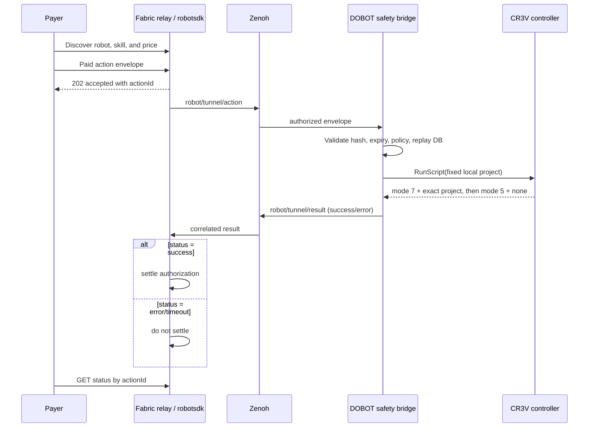

# Fabric Foundation × DOBOT CR3V Tier 3 profile

This profile exposes one paid physical skill,
`cra_two_cycle_pick_place`. It is Tier 3 because the published controller logic
composes two pick/place cycles from joint moves, a relative linear lift,
digital-output gripper control, bounded speed/acceleration, dwell timing, and a
safe home return. `RunScript` starts that custom program; it is not itself the
skill implementation.

## Status

The custom controller project and historical Fabric-triggered physical motion
were validated on 2026-07-15. The new Zenoh action/result bridge and durable
contract are included here, but the latest asynchronous relay flow and
no-settle-on-failure behavior still require a fresh physical acceptance run.
See `validation-report.md` for the precise claim boundary.

The repository includes a
[privacy-redacted video of the complete historical task](evidence/dobot-cr3v-historical-physical-evidence-redacted.mp4)
and its [evidence manifest](evidence/evidence-manifest.yaml). The derivative is
video-only; the bystander/laptop region is opaque-masked and source audio and
metadata were removed. It proves the physical two-cycle task, not the newer
asynchronous result/no-settle path.

## Architecture and settlement gate



The relay/robotsdk owns payment verification, robot identity/wallet binding,
immediate HTTP acceptance, and post-result settlement. This package owns the
local Zenoh-to-controller boundary and publishes `settlementEligible` as a
policy input; it never settles payment itself.

## Topics and schemas

- Action: `robot/tunnel/action`
- Result: `robot/tunnel/result`

The required action fields are shown in
`../examples/action-envelope.pick-place.json`. `paramsHash` is lower-case
SHA-256 of canonical UTF-8 JSON (`sort_keys=true`, separators `,` and `:`).
For this parameter-free skill the canonical object is `{}`, whose digest is
`44136fa355b3678a1146ad16f7e8649e94fb4fc21fe77e8310c060f61caaff8a`.

The payer sends the API body and payment header described by `functions.yaml`;
the trusted relay creates the exact normalized `payment` object placed on
Zenoh. Raw signatures, private keys, payer addresses, and post-execution
transaction receipts must not be copied into the robot-side envelope.

Success result:

```json
{
  "schemaVersion": "robot-action-result.v1",
  "actionId": "act_example",
  "robotId": "dobot-cra-demo-001",
  "skillId": "cra_two_cycle_pick_place",
  "idempotencyKey": "example-001",
  "paramsHash": "44136fa355b3678a1146ad16f7e8649e94fb4fc21fe77e8310c060f61caaff8a",
  "status": "success",
  "settlementEligible": true,
  "result": {"message": "Custom two-cycle pick-and-place project completed"},
  "timestamp": "2099-01-01T00:00:30Z"
}
```

An error uses `status: error`, a stable error `code`, a message and
`retryable`, and always sets `settlementEligible: false`.
Results intentionally do not repeat the payee wallet or authorization ID; the
relay correlates its private authorization record through `actionId`.

## Requirements

- A safety-integrated DOBOT CR3V workcell with CC262V controller.
- DobotStudio Pro in TCP/IP mode and a reviewed, locally deployed controller
  project created from `controller-project/`.
- Python 3.10 or later.
- A Zenoh router reachable from the robot-side computer.
- DOBOT's official `TCP-IP-Python-V4` SDK. Source and license details are under
  `vendor/TCP-IP-Python-V4/`.
- A result-aware RoboPay relay/robotsdk configured to settle only after a
  correlated success result.

## Install

From this profile directory:

```bash
python -m venv .venv
. .venv/bin/activate
python -m pip install -r bridge/requirements.txt
git clone https://github.com/Dobot-Arm/TCP-IP-Python-V4.git vendor-sdk
git -C vendor-sdk checkout d651981db004f2c906625b2eba007e5f873a6151
git -C vendor-sdk hash-object dobot_api.py
# expected: 90f430da8787cb72246920c1c3b8e6651367fcfb
```

On Windows PowerShell, activate with `.venv\Scripts\Activate.ps1`.

Copy `bridge/config.example.json` outside the checkout, set a private replay DB
path, and keep `safety.approved` false until site review. Do not place secrets,
controller addresses, or exact point files in the repository.

## Environment variables

| Variable | Used by | Purpose |
| --- | --- | --- |
| `ROBOT_ID` | relay/robotsdk | Public, stable robot identity matching the profile |
| `ROBOT_PRIVATE_KEY` | relay/robotsdk | Robot authentication key; never log or commit |
| `ROBOT_PAYEE_ADDRESS` | relay and local policy check | Full payee wallet; never print in evidence |
| `DOBOT_ROBOT_IP` | local bridge | Controller address on the private robot network |
| `DOBOT_PROJECT_ARTIFACT` | local bridge | Private path to the approved exported ZIP |
| `DOBOT_CRA_SAFETY_ACK` | local bridge | Explicit real-execution acknowledgement |

Use a secret manager or process environment. Never place real values in JSON,
shell history, screenshots, or videos.

## Start Zenoh and the bridge

Example local router listener:

```bash
zenohd -l tcp/127.0.0.1:7447
```

Dry-run mode subscribes and validates but sends no controller command:

```bash
export ROBOT_PAYEE_ADDRESS='replace-in-private-environment'
python bridge/dobot_cra_zenoh_bridge.py --config /private/bridge.json
```

Dry-run results use `status: pending`, include `dryRun: true`, and always set
`settlementEligible: false`; they are never physical-completion evidence.

For real execution, after the integrator has approved the workcell and changed
the private config's `safety.approved` to true:

```bash
export DOBOT_ROBOT_IP='private-controller-address'
export DOBOT_PROJECT_ARTIFACT='/private/test-cr3v-20260715.zip'
export DOBOT_CRA_SAFETY_ACK='I_HAVE_VERIFIED_THE_CRA_SAFETY_SETUP'
python bridge/dobot_cra_zenoh_bridge.py \
  --config /private/bridge.json \
  --sdk-dir vendor-sdk \
  --execute
```

The bridge verifies the private artifact's SHA-256 before connecting. It then
requires mode 5 and no active project, sends `RunScript` once, observes the
exact project in mode 7, and reports success only after mode 5/no active project
returns. Error, pause, collision, unexpected-project, and timeout paths attempt
one `Stop()` and publish an error result.

The digest binds the local approval/export record; the available controller API
does not cryptographically attest that the stored project bytes match that
archive. Use a new project name for every approved revision and control
deployment separately.

## Reproduce contract tests

```bash
python -m pip install -r tests/requirements.txt
python -m unittest discover -s tests -p "test_*.py" -v
```

The static JSON example uses documentation timestamps. Generate fresh payment
`issuedAt` and `expiresAt` values before sending it to a live bridge; never
reuse its `actionId`, `idempotencyKey`, or authorization ID.

## Expected behavior

- Unpaid requests: relay returns 402; no Zenoh action and no robot motion.
- Paid authorized request: relay immediately returns 202/pending and publishes
  exactly one action.
- Success: result is correlated by `actionId`; only then may the relay settle.
- Error/timeout: result sets `settlementEligible: false`; relay must not settle.
- Replay: the relay should reject it before Zenoh. If it still reaches the
  bridge, the durable store never repeats the motion. A cached terminal result
  is labeled `DUPLICATE` and is always changed to `settlementEligible: false`;
  unresolved state fails closed. `actionId` and `payment.authorizationId` are
  also globally single-use in the local replay database.

## Safety and troubleshooting

- `ROBOT_NOT_IDLE`: enable the robot through the approved operator procedure
  and confirm no project is active.
- `ARTIFACT_HASH_MISMATCH`: do not run; reconcile the deployed/exported project
  under change control.
- `ACTION_START_TIMEOUT` or `ACTION_TIMEOUT`: inspect the controller and
  workcell after the bridge's `Stop()` attempt; do not blindly retry.
- `IDEMPOTENCY_IN_FLIGHT`: an earlier execution has ambiguous durable state.
  Reconcile it with controller logs before making any new request.
- `PAYMENT_ALREADY_SETTLED`: the relay used the old unsafe ordering. Correct the
  relay so authorization precedes execution and settlement follows success.

The physical emergency stop and safety controller remain authoritative.
Software `Stop()` is not a substitute for workcell risk assessment, guarding,
payload/tool validation, collision settings, or trained operator supervision.

## Privacy and publication

Public evidence may show the Fabric Foundation × DOBOT branding, skill name,
price, masked transaction fingerprint, and non-sensitive software versions.
Mask faces, wallets, payer identity, host/user names, controller addresses,
serial numbers, QR codes, and exact taught points. Keep raw artifacts and logs
in controlled evidence storage.
