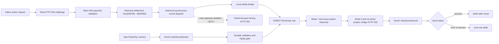

# Task traceability

This document separates historical physical evidence from the new asynchronous
RoboPay contract. It intentionally masks public-chain identities and omits
workcell coordinates, controller addresses, host names, user names, and device
serial numbers.

## Execution lineage

The solid historical path through `I` was observed on the physical robot:
**historical real x402 payment validation and settlement completed**. Its
ordering is also visible: historical settlement `D` preceded dispatch `E`.
The new path `K` through `Q` is implemented and unit-tested locally but still
requires a fresh physical end-to-end run with a result-aware Fabric relay.

## Evidence register

| ID | Evidence | Public reference | Privacy treatment | Status |
| --- | --- | --- | --- | --- |
| D-CODE-001 | Team-authored multi-stage Lua logic | `controller-project/src0.lua` | Exact workcell points removed | Public |
| D-ART-001 | Controller export used on 2026-07-15 | SHA-256 `fba9675e7c34bbbd1ef9c0b0710b0eb7b15fbe02362c1aecc6dd8b8e0260d6e8` | Coordinate-bearing ZIP not published | Committed digest |
| D-TX-001 | Base Sepolia payment and settlement for the physical run | Private evidence ledger; public fingerprint `0xeeb0878b...38d459d3` | Full transaction, payer, payee, and payloads withheld | Historical real settlement completed |
| D-HTTP402-001 | Historical real x402 challenge terminal record | [`evidence/terminal/dobot-cr3v-historical-payment-402-redacted.png`](evidence/terminal/dobot-cr3v-historical-payment-402-redacted.png); SHA-256 `9fd4b958f905a8ab19e8f95fca05f0e135efcde75d452eab94f9e2f7143a67ee` | Deterministic crop; payment payload and local paths excluded | Included public evidence asset |
| D-SETTLE-001 | Historical tunnel completion and settlement terminal record | [`evidence/terminal/dobot-cr3v-historical-settlement-tunnel-redacted.png`](evidence/terminal/dobot-cr3v-historical-settlement-tunnel-redacted.png); SHA-256 `030f037b47c8d923e7e25144d14bdf0660297c127bace7fae3e50f15cab9c531` | Opaque masks cover full payer/transaction, response UUID/Base64, and payload; audit overlay shows only masked fingerprint/status | Included public evidence asset |
| D-BRIDGE-001 | `REAL_EXECUTION` bridge `RunScript("test")` running/completion record | [`evidence/terminal/dobot-cr3v-historical-bridge-completion-redacted.png`](evidence/terminal/dobot-cr3v-historical-bridge-completion-redacted.png); SHA-256 `41aecd38a9f55345e14c663ce84ec4eb148abc47fc083df2ada577808e17e333` | Deterministic crop excludes workstation path and private controller address | Included public evidence asset |
| D-CTRL-001 | Controller/software version capture | Values transcribed in validation report | Serial numbers and screenshot withheld | Historical |
| D-RUN-001 | Privacy-redacted physical two-cycle pick/place video | [`docs/evidence/dobot-cr3v-historical-physical-evidence-redacted.mp4`](evidence/dobot-cr3v-historical-physical-evidence-redacted.mp4); SHA-256 `6c479d7bfcc4143742e144a1984c2e2d718d224b26f0d1b218c9bd79aabdd1a4` (9,996,615 bytes; 30.50 s) | Robot motion only; no audio, terminal, wallet, host, serial, or user data | Included public evidence asset |
| D-ASYNC-001 | New Zenoh action/result physical run | To be captured | Same masking policy | Not yet run |
| D-FAIL-001 | Timeout/error result and no-settlement proof | To be captured from result-aware relay | Wallets and authorization secrets masked | Not yet run |

Historical skill ID `cra_safe_demo` and registry skill ID
`cra_two_cycle_pick_place` are linked by the same fixed project name and
D-ART-001 digest. The registry ID still requires its own fresh paid acceptance
run.

The machine-readable derivative record is
[`docs/evidence/evidence-manifest.yaml`](evidence/evidence-manifest.yaml).

## Requirement mapping

| RoboPay requirement | Implementation or evidence | State |
| --- | --- | --- |
| Custom Tier 3 behavior | D-CODE-001 composes 13 joint/linear moves, two gripper cycles, waits, relative lifts, and home returns | Proven in source and historical robot run |
| Physical robot | CR3V/CC262V hardware and D-RUN-001 | Historical run and privacy-redacted video available |
| Historical real x402 payment and settlement | D-HTTP402-001 and D-SETTLE-001, cross-referenced to D-TX-001 | Completed on 2026-07-15; old pre-dispatch settlement order disclosed |
| Historical bridge completion | D-BRIDGE-001 and D-RUN-001 | Real `RunScript("test")`, controller completion, local HTTP 200, and physical motion observed |
| Action/result correlation | `actionId` in both Zenoh schemas | Implemented; physical retest pending |
| Envelope integrity | `paramsHash`, expiry, payment-policy checks | Unit-testable |
| Durable replay protection | SQLite idempotency/fingerprint store | Unit-testable |
| Failure semantics | Structured error, `Stop`, timeout, `settlementEligible: false` | Bridge unit-testable |
| No settlement on failure | Relay must consume result before settlement | Contract specified; result-aware relay test pending |
| Privacy | Environment variables, masked chain identity, sanitized taught points | Applied to this profile |
