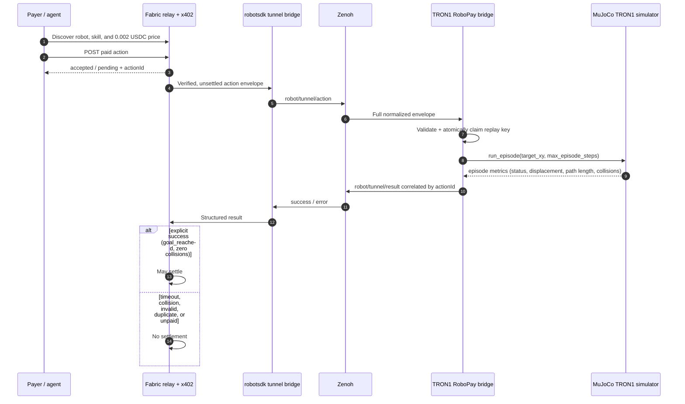

# LimX TRON1 — RoboPay Integration (Tier 1)

Simulator-only Tier 1 submission connecting the Fabric RoboPay contract to a
MuJoCo simulation of the LimX TRON1 wheeled-biped robot, via the shared
Zenoh tunnel transport.

## Files

| File | Purpose |
|------|---------|
| `robot.profile.yaml` | Runtime, identity, and kinematic metadata for the TRON1 simulator profile |
| `skills.yaml` | Discoverable, priced obstacle-navigation skill contract |
| `functions.yaml` | Agent-facing discovery, action, and status functions |
| `payment-policy.yaml` | Base Sepolia USDC policy and result-gated settlement rule |
| `execution-mapping.yaml` | Zenoh-to-MuJoCo mapping and completion semantics |
| `examples/action-envelope.obstacle-nav.json` | Non-production example envelope |
| `bridge/tron1_zenoh_bridge.py` | Fail-closed Zenoh/MuJoCo robot adapter |
| `simulation/scenes/tron1.xml` | TRON1 MuJoCo scene (wheeled-biped actuators, obstacles, goal) |
| `simulation/runners/tron1_runner.py` | Episode runner: navigation policy + live-computed rolling gait + collision detection |
| `simulation/webots/worlds/tron1_obstacle_nav.wbt` | Webots world (proxy robot, same obstacle/goal layout) for Sim-to-Sim validation |
| `simulation/webots/controllers/tron1_navigation/tron1_navigation.py` | Webots controller running the identical navigation policy |
| `simulation/validation/validate_sim_to_sim.py` | Compares MuJoCo vs Webots outcome and writes a PASS/FAIL report |
| `demo/run_demo.py` | End-to-end demo: unpaid → paid/success → replay-blocked → stop |
| `demo/run_failure_demo.py` | Deliberate-failure demo: timeout → no settlement |
| `tests/skill-contract.test.yaml` | Human-readable contract cases |
| `tests/test_bridge.py` | Executable parser, replay, result, and settlement-gate tests |

## End-to-end architecture



## Robot spec

| Parameter | Value |
|-----------|-------|
| Type | Wheeled-biped (2 legs, hip-knee-wheel each) |
| Mass | 14.0 kg |
| Standing height | 0.55 m |
| DOF | 9 (2 x hip/knee/wheel + 3 planar base) |
| Forward vx | [0, 1.2] m/s |
| Angular wz | [-1.0, 1.0] rad/s |

## Simulator model

The TRON1 base moves on a planar (slide-x, slide-y, hinge-yaw) mount driven
every simulation step by a potential-field navigation policy (velocity
actuators). Unlike a walking quadruped, TRON1's legs hold a live-computed
stance posture (hip/knee position-actuated) while both wheel joints spin
proportional to commanded forward speed each step -- a real, live-computed
rolling gait, not a pre-recorded animation. Obstacle collisions are judged
with MuJoCo's own narrow-phase contact detection against the base geometry,
not a proximity heuristic.

This is a deliberate simplification of full wheeled-biped balance control
(out of scope for a Tier 1 navigation skill): the base does not rely on the
legs/wheels for support, so we avoid needing a full standing/balance
controller while still exercising real per-step physics, real actuation,
and real collision detection for the obstacle-avoidance skill.

## Sim-to-Sim validation

The same potential-field navigation policy runs unmodified in two physics
engines -- MuJoCo (primary scene) and Webots (proxy robot body, same
obstacle layout and goal). This is a consistency check on the policy
itself, not a replication of the full leg/wheel model: the Webots side
uses a simple rigid body driven by the same policy code, not a 9-DOF
wheeled-biped.

```bash
python demo/run_demo.py   # writes docs/evidence/tron1_metrics.json
webots --mode=fast --batch simulation/webots/worlds/tron1_obstacle_nav.wbt
python simulation/validation/validate_sim_to_sim.py
```

Both engines must reach `goal_reached` with zero collisions, and
displacement/remaining-distance must agree within tolerance. Results are
written to `docs/evidence/sim_to_sim_validation.json`.

## Running locally

```bash
pip install -r tests/requirements.txt
python -m pytest tests/test_bridge.py -v
python demo/run_demo.py
python demo/run_failure_demo.py
```

## Result-gated settlement contract

Settlement is only eligible when:
- the episode status is `goal_reached`, and
- the collision count (real MuJoCo contacts against obstacles) is `0`.

Timeout, collision, unpaid, expired, malformed, and duplicate/replayed
actions never produce `settlementEligible: true`.
