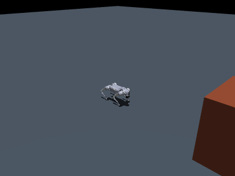

# Unitree Go2 Tier 1 — paid action triggers navigation in simulation

**Scope: simulator-only submission.** No physical robot is involved; the
x402 payment gate is exercised against the real tunnel binary and the
on-chain settlement step is simulated.

A paid RoboPay action arriving on the tunnel's Zenoh topic starts an
obstacle-navigation episode on the official Unitree Go2 model. The robot is
driven by a planner and a gait controller, not by any recorded motion, and
the same code runs in two simulators (MuJoCo and Webots) with a measured
comparison between them.



The chain, top to bottom:

    paid action (x402 / AIP) -> tunnel -> Zenoh "robot/tunnel/action"
    -> subscriber -> A* over the obstacle map -> pure pursuit -> (vx, wz)
    -> trot gait (Raibert foot placement, leg IK, joint PD) -> 12 torques
    -> MuJoCo / Webots

Obstacle layout and goal are parameters. Changing either changes the plan
and the resulting trajectory; test_nav.py checks this explicitly.

## Requirements

- Python 3.10+, `pip install mujoco eclipse-zenoh numpy websockets`
- Go 1.21+ for the tunnel (`make build` fetches zenoh-c)
- Webots R2025a for the sim-to-sim part. Looked up at `/Applications/Webots.app`,
  override with `WEBOTS_HOME`.

Developed and validated on macOS arm64.

## Setup

```sh
cd simulation
./setup.sh          # fetch the official Go2 model assets (pinned commits)
cd .. && make build # tunnel binary -> bin/tunnel
```

## Tests

Each test prints its metrics as JSON and PASS/FAIL, and exits nonzero on
failure.

```sh
cd simulation/go2
python3 test_ik.py               # leg IK against MuJoCo forward kinematics
python3 test_gait.py             # stand / walk straight / turn / arc
python3 test_nav.py              # 5 navigation layouts, collision counts
python3 test_payment_gate.py     # unpaid POST /action -> 402, nothing published
python3 test_result_semantics.py # success/error results, replay, tampering
python3 test_link.py             # paid action -> Zenoh -> episode -> result
cd ../webots
python3 test_sim2sim.py          # same tasks in MuJoCo and Webots, compared
```

test_payment_gate.py and test_link.py run the real tunnel binary. The
first one acts as the cloud proxy, forwards an unpaid `POST /action`
through the tunnel's websocket, and expects the x402 middleware to answer
402 with payment requirements — while nothing appears on the robot topic.
The second publishes a paid-action event (the exact `handlers.PostAction`
schema) and expects the robot to run the episode and reach the goal. So
the payment gate is exercised for real; only the on-chain settlement is
simulated. Both payment rails (x402 and the AIP agent) publish to the same
topic, which is why the simulation subscribes there. The repo's ROS 2
bridge targets Isaac Sim on Linux; on macOS, subscribing to the same Zenoh
topic is the equivalent integration point.

## Wire contract

Zenoh topics (peer mode; the tunnel and the Python processes discover each
other on localhost, no separate router needed):

| topic | direction | schema |
|---|---|---|
| `robot/tunnel/action` | tunnel -> robot | tunnel event: `{payload, transaction_details, timestamp}`; `payload` is the action envelope `{actionId, robotId, skillId, params, paramsHash, idempotencyKey, payment}` |
| `robot/tunnel/result` | robot -> relay | `{"status": "success", actionId, skill, result: {metrics}}` or `{"status": "error", actionId, skill, error: {code, message}}` |

The skill catalog lives in `go2/skills.json` (one priced skill,
`navigate_to`, $0.002; printed at startup for discovery). `robopay_link.py`
validates every envelope: unknown skill, out-of-schema or tampered params
(`paramsHash` is sha256 of canonical JSON), wrong robotId, and replayed
`idempotencyKey` all produce an error result and never actuate the robot.
Error codes: `UNKNOWN_SKILL, INVALID_PARAMS, WRONG_ROBOT, NO_PATH,
ACTION_FAILED, DUPLICATE`. **The relay must settle only on
`"status": "success"`** — `test_result_semantics.py` proves every failure
path yields an error result (no-settle-on-failure evidence).

Configuration (env vars, defaults in parentheses):

- `ROBOPAY_ACTION_TOPIC` (`robot/tunnel/action`), `ROBOPAY_RESULT_TOPIC`
  (`robot/tunnel/result`), `ROBOPAY_ROBOT_ID` (`test-robot`, matching
  `tunnel/config.json`)
- tunnel: `PROXY_WS_URL` (relay), plus its own `config.json`
  (robot_id, payee address, price, network) — no private keys are used or
  stored anywhere in this submission
- `WEBOTS_HOME` (`/Applications/Webots.app`)

A machine-readable robot profile (skills, payment policy, execution
mapping, example envelope, validation report) is in
`registry/vendors/unitree/go2/unitree.go2.mujoco-webots-sim.v1/`.

## Sim-to-sim results

| layout | simulator | reached | collisions | time | path length |
|---|---|---|---|---|---|
| A (3 obstacles, goal 10 m ahead) | MuJoCo | yes | 0 | 25.96 s | 10.64 m |
| A | Webots | yes | 0 | 24.78 s | 10.16 m |
| B (different layout and goal) | MuJoCo | yes | 0 | 21.96 s | 8.83 m |
| B | Webots | yes | 0 | 20.74 s | 8.45 m |

The Webots controller imports `go2_gait.py` and `go2_nav.py` unchanged;
only the simulator I/O differs. Trajectory agreement between the two
engines: mean gap 2.4–2.5 cm, max 6.1 cm (`webots/sim2sim_report.json`).

Episode metrics all come from the physics engine: final goal distance,
path completion, path length, sim time, collision count with foot–ground
touchdowns excluded (MuJoCo: `mjData.contact` pairs; Webots: supervisor
contact points on the obstacle solids).

## Troubleshooting

- **Tests hang waiting for Zenoh messages**: another process may hold a
  stale session (e.g. a leftover tunnel). `pkill -f bin/tunnel` and retry.
- **`tunnel binary missing`**: run `make build` at the repo root first.
- **HTTPS blocked when fetching models**: `GIT_HOST=git@github.com: ./setup.sh`
  clones over SSH instead.
- **Webots controller can't connect**: the runner talks to Webots over
  `tcp://127.0.0.1:1234`; make sure no other Webots instance is running, or
  change `PORT` in `webots/run_webots.py`. First launch of a freshly
  installed Webots can take a minute — the runner waits for the port.
- **Corporate proxy environments**: the payment-gate test starts the tunnel
  with a minimal environment so `HTTPS_PROXY` does not intercept the
  localhost websocket.

## Layout

```
simulation/
├── setup.sh                 fetch pinned official Go2 model assets
├── go2/
│   ├── go2_gait.py          trot gait: Raibert placement, leg IK, joint PD
│   ├── go2_nav.py           A* planner, pure pursuit, episode metrics
│   ├── robopay_link.py      action validation, episode execution, results
│   ├── skills.json          priced skill catalog (discovery)
│   ├── simulate_paid_action.py
│   └── test_*.py
└── webots/
    ├── protos/Go2.proto     official unitree_ros URDF via urdf2webots
    ├── worlds/go2_nav.wbt   generated by make_world.py (layout A)
    ├── controllers/go2_nav_webots.py
    ├── make_world.py        same layout parameters as the MuJoCo scene
    ├── run_webots.py        headless episode runner
    ├── test_sim2sim.py
    └── sim2sim_report.json
```
